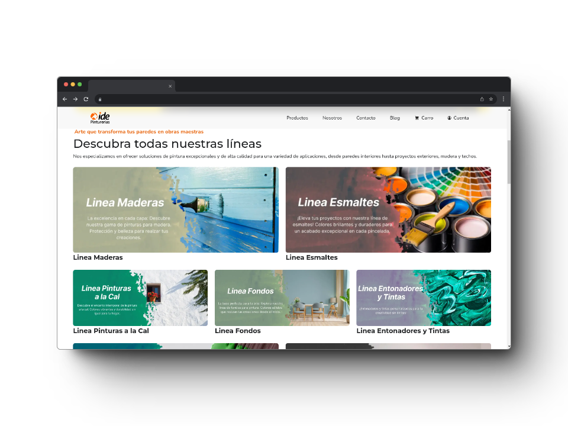
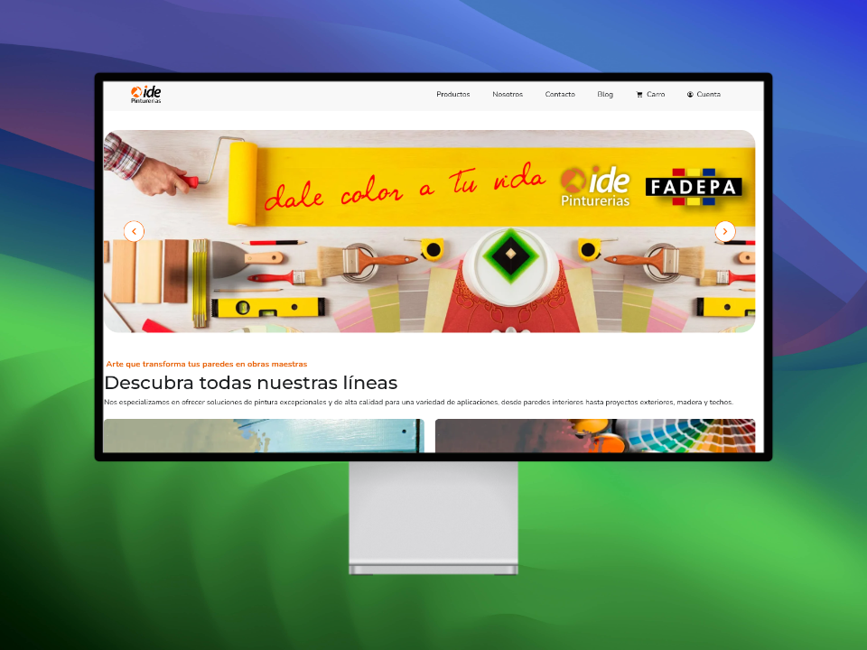
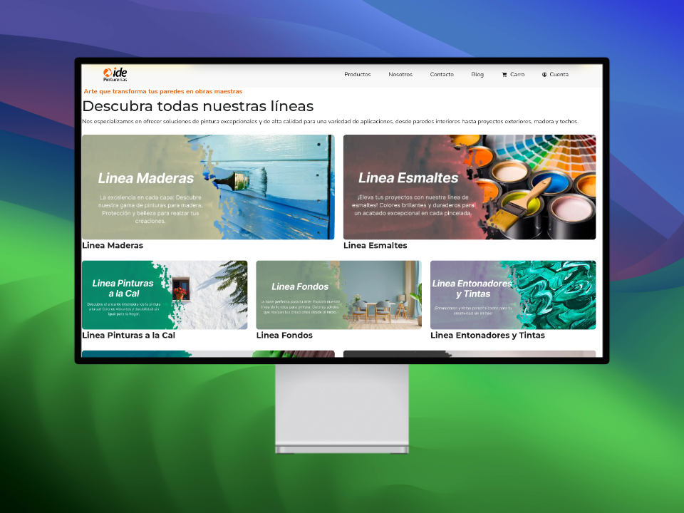
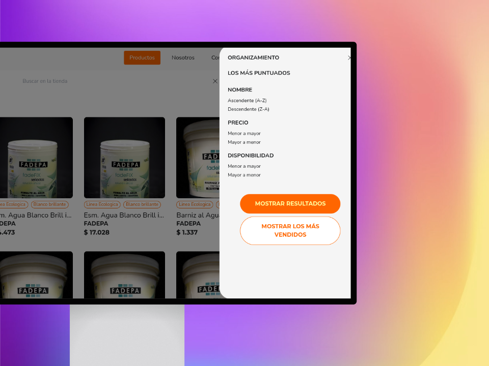
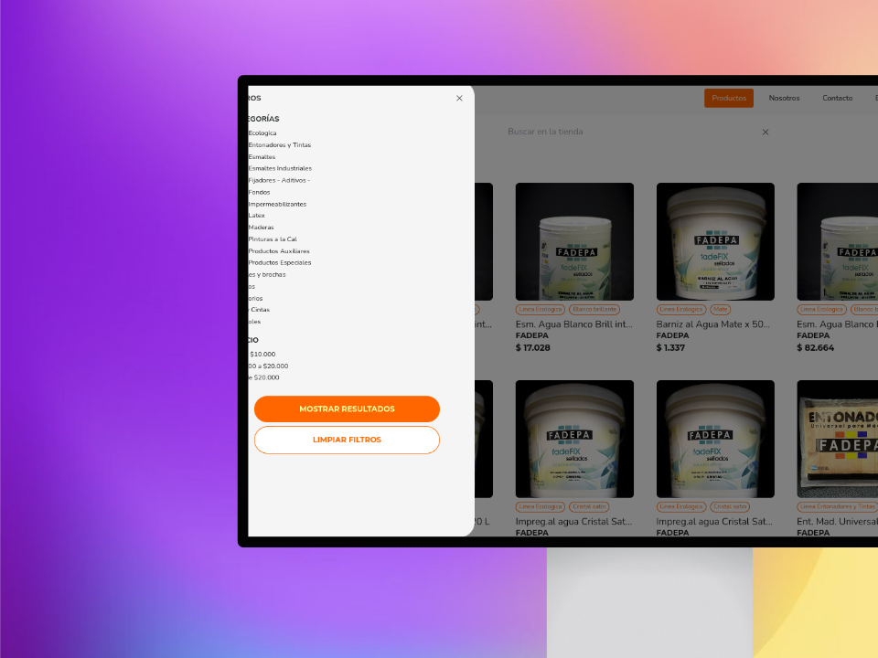

# Aplicación Cliente de Pinturas App

## Descripción

Este es el componente del lado del cliente del proyecto Pinturas App, una aplicación web diseñada para una tienda de pinturas. La aplicación proporciona una interfaz fácil de usar para los clientes para:

- **Buscar Productos**: Buscar y explorar una amplia gama de productos de pintura.
- **Carrito de Compras**: Añadir artículos deseados a un carrito de compras para una compra fácil.
- **Realizar Pedido**: Realizar pedidos sin problemas a través de la aplicación.
- **Historial de Pedidos**: Ver el historial de pedidos anteriores, incluyendo información detallada.
- **Estado del Pedido**: Rastrear el estado de cada pedido en tiempo real.

Pinturas App tiene como objetivo mejorar la experiencia de compra para los clientes de la tienda de pinturas al ofrecer una plataforma de compras en línea completa e intuitiva.

## Tecnologías Utilizadas

## Despliegue

La aplicación se desplegó continuamente durante el desarrollo utilizando los servicios de
.
Ahora, hemos pasado a

durante las etapas finales del desarrollo.

## Estado de las Pruebas

## Documentación

La documentación para este proyecto está disponible en el archivo
[DOCS.md](./DOCS.md).

## Colaboradores

Este proyecto no habría sido posible sin la ayuda de las siguientes personas increíbles

## Repositorio del Backend

El repositorio del backend para este proyecto se puede encontrar en
.

## Algunas vistas

### Página de Inicio

### Página de Productos

### Detalles del Producto

### Contacto

