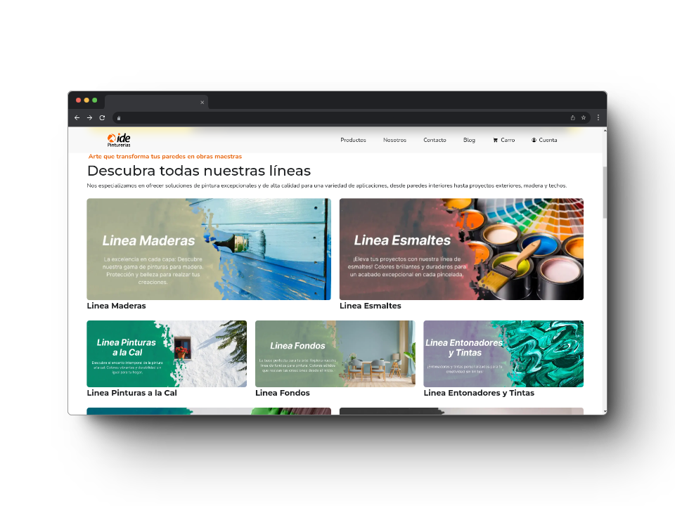
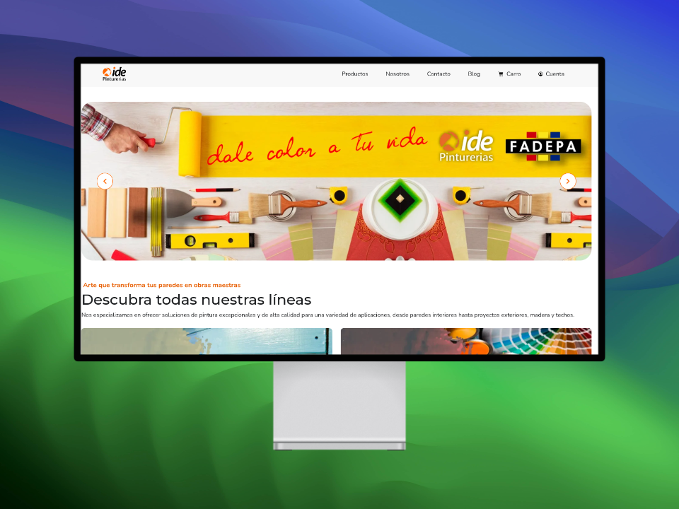
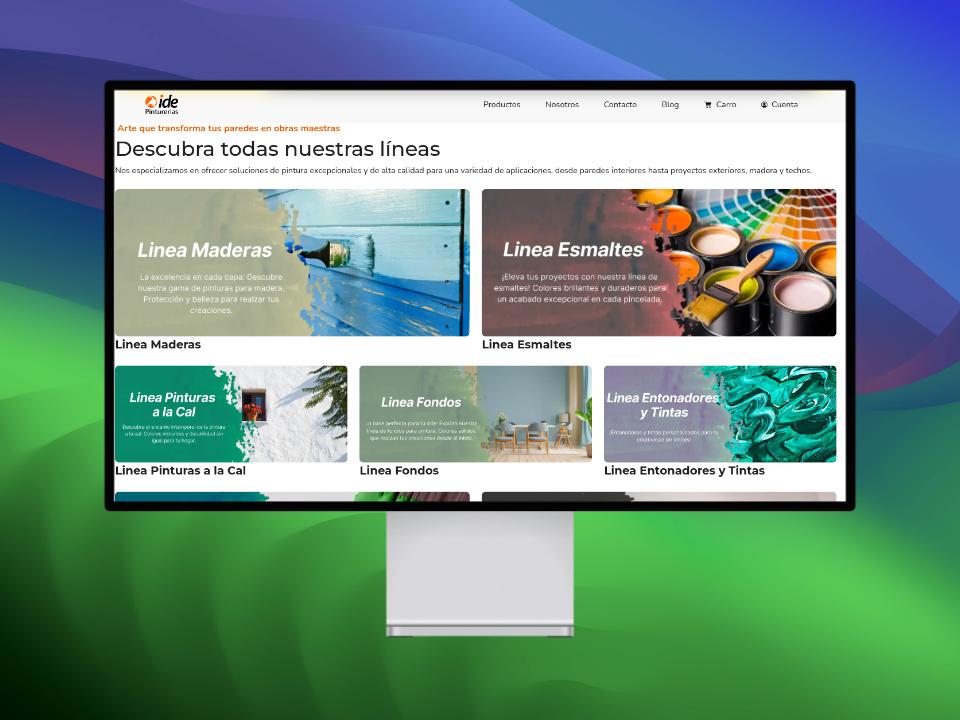
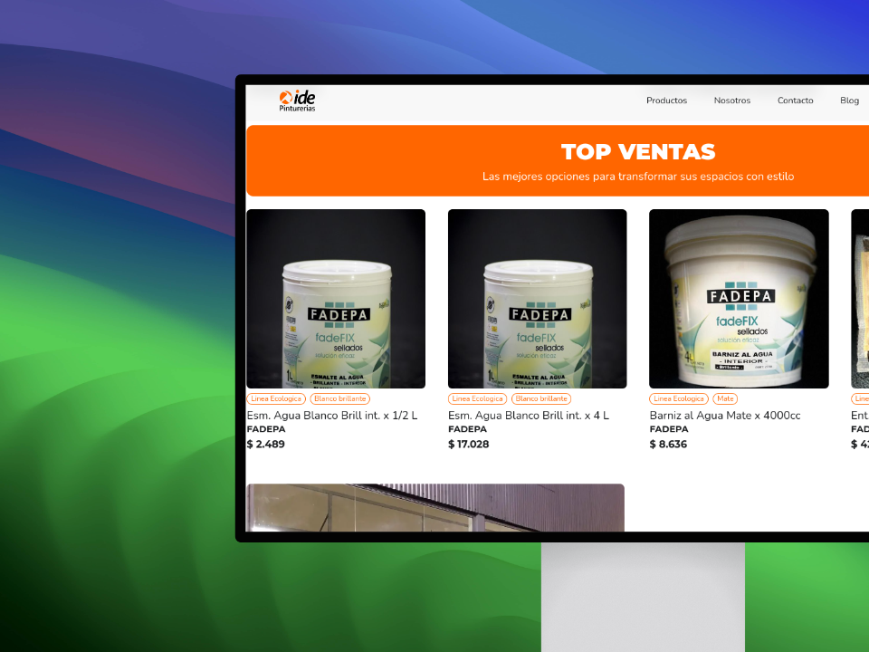
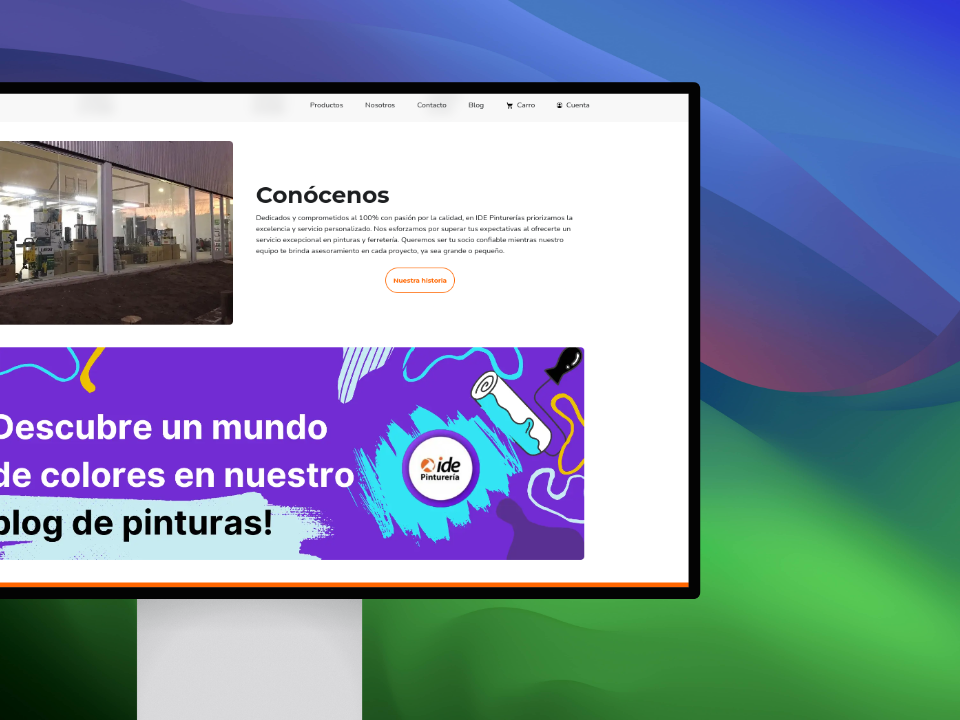
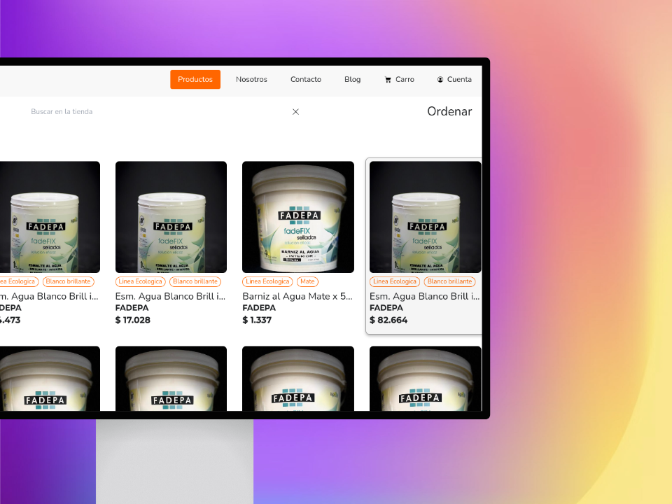
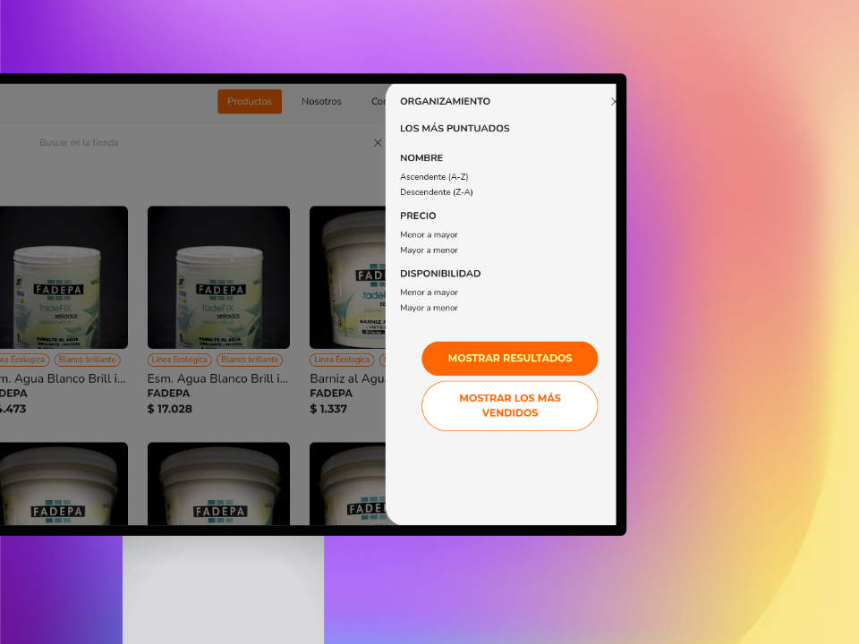
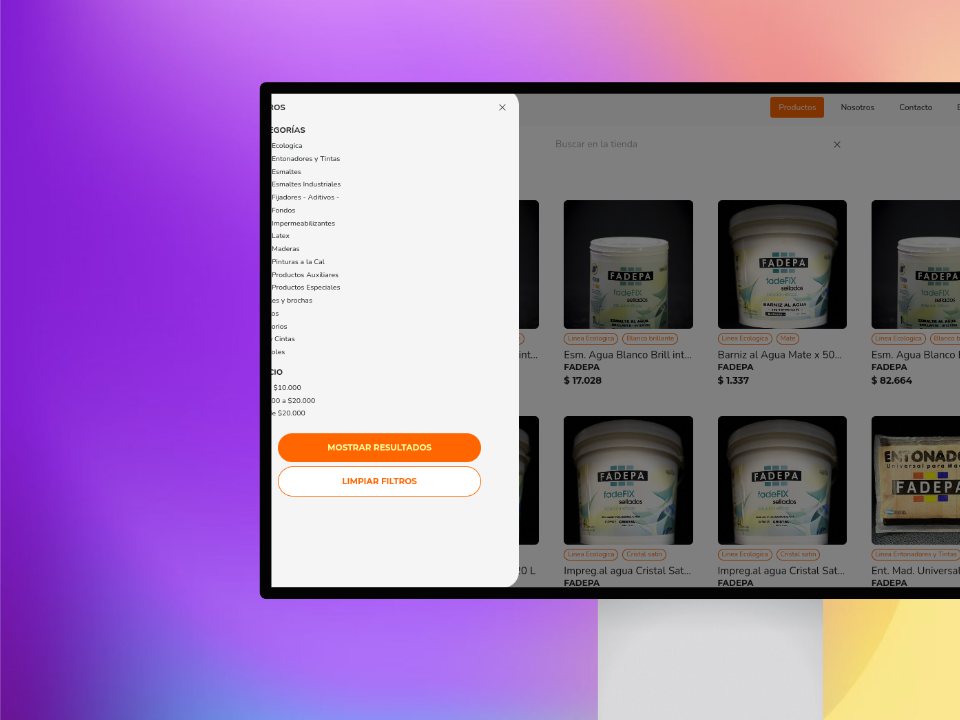
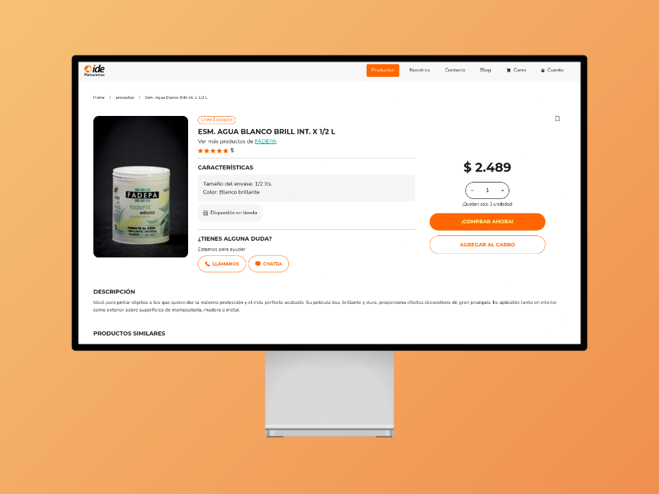
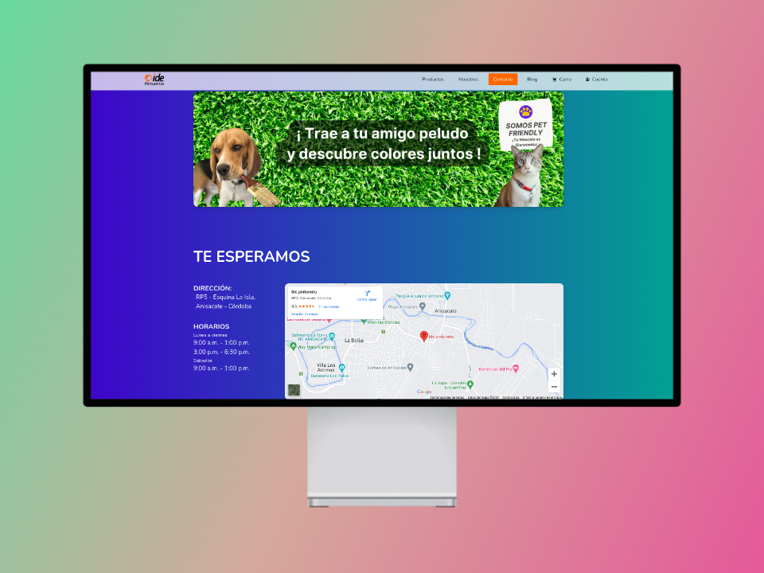

# Pinturas App Client App

## Description

This is the client-side component of the Pinturas App project, a web application designed for a paint store. The application provides a user-friendly interface for customers to:

- **Browse Products**: Search for and explore a wide range of paint products.
- **Shopping Cart**: Add desired items to a shopping cart for easy purchase.
- **Order Placement**: Place orders seamlessly through the app.
- **Order History**: View the history of past orders, including detailed information.
- **Order Status**: Track the status of each order in real-time.

The Pinturas App aims to enhance the shopping experience for paint store customers by offering a comprehensive and intuitive online shopping platform.

## Tech Stack

## Deployment

The application was continuously deployed during development using the

services. Now, we moved on to

during the final stages of development.

## Testing Status

## Documentation

The documentation for this project is available in the file
[DOCS.md](./DOCS.md).

## Contributors

This project could not have been possible without the help of the following amazing people

## Backend Repository

The backend repository for this project can be found at
.

## Some Views

### Home Page

### Products Page

### Product Details

### Contact

